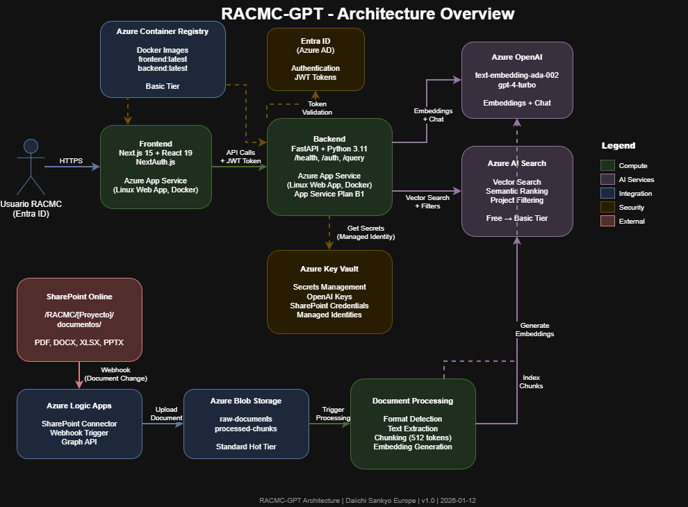

# RACMC-GPT


---

## 📋 Descripción

**RACMC-GPT** es un asistente de IA basado en RAG (Retrieval-Augmented Generation) diseñado específicamente para el equipo de RACMC de Daiichi Sankyo Europe. El sistema proporciona búsqueda semántica y respuestas inteligentes sobre documentación regulatoria farmacéutica, con capacidades de rastrabilidad completa y autenticación segura mediante Entra ID.

Un sistema integral que combina tecnología de IA moderna con requisitos de seguridad y cumplimiento normativo de la industria farmacéutica.

> **Nota sobre Migración a Next.js**: Este proyecto ha migrado de una arquitectura React SPA a Next.js 15 con App Router para mejorar el rendimiento, la seguridad y la experiencia del desarrollador. Ver [MIGRATION.md](./docs/MIGRATION.md) para detalles completos.

---

## ✨ Características Clave

- **🔍 Búsqueda Semántica Avanzada**: Recuperación inteligente de documentos regulatorios basada en embeddings
- **🤖 Respuestas Generadas por IA**: Procesamiento de lenguaje natural con OpenAI GPT para respuestas contextualmente relevantes
- **� Conversaciones Momentáneas**: Chat sin persistencia entre sesiones, ideal para consultas casuales y búsquedas ad-hoc
- **🔐 Autenticación Entra ID**: Integración segura con Azure Entra ID para gestión de identidades
- **⚡ Procesamiento Asincrónico**: Flujos de trabajo automatizados mediante Logic Apps de Azure
- **🏢 Cumplimiento Normativo**: Diseño seguro con Key Vault para gestión de secretos
- **📊 Monitoreo y Observabilidad**: Logging completo mediante Application Insights, Azure Monitor y Log Analytics
- **📱 Interfaz Intuitiva**: Dashboard reactivo y responsivo para acceso fácil

---

## 🏗️ Arquitectura



**Documentación completa:** [Architecture Design](./docs/architecture.md)  
**Diagrama editable:** [architecture.drawio](./docs/diagrams/architecture.drawio)

---

## 📁 Estructura del Proyecto

```
Daiichi-Sankyo-RACMC-GPT/
├── 📄 README.md                    # Este archivo
├── 📋 assumptions.md               # Suposiciones del proyecto
├── docs/                           # Documentación
│   ├── architecture.md
│   ├── api-specification.md
│   └── deployment-guide.md
├── frontend/                       # Aplicación Next.js
│   ├── src/
│   │   ├── app/                   # App Router (Next.js 15)
│   │   ├── components/            # Componentes React
│   │   ├── auth.config.ts         # Configuración NextAuth
│   │   └── services/              # Servicios API
│   ├── public/
│   ├── package.json
│   └── next.config.ts
├── backend/                        # API FastAPI
│   ├── app/
│   │   ├── main.py
│   │   ├── routers/
│   │   ├── models/
│   │   └── services/
│   ├── tests/
│   ├── requirements.txt
│   └── Dockerfile
├── infra/                          # Infraestructura como Código
│   ├── main.tf
│   ├── variables.tf
│   ├── outputs.tf
│   └── environments/
│       ├── dev.tfvars
│       └── prod.tfvars
├── scripts/                        # Utilidades y scripts
│   ├── setup.sh
│   ├── deploy.sh
│   └── seed-data.py
├── mockups/                        # Diseños y prototipos
│   ├── wireframes/
│   └── mockups.figma
└── .gitignore
```

---

## 🚀 Guía Rápida de Inicio

### Prerequisitos

Asegúrate de tener instalado:

- **Node.js** 18+ ([Descargar](https://nodejs.org/))
- **Python** 3.11+ ([Descargar](https://www.python.org/))
- **Terraform** 1.0+ ([Descargar](https://www.terraform.io/downloads))
- **Azure CLI** 2.50+ ([Descargar](https://docs.microsoft.com/cli/azure/install-azure-cli))
- **Docker** (recomendado para desarrollo local)

### Configuración Inicial

#### 1. Clonar el repositorio

```bash
git clone https://github.com/avalle-syntonize/RACMC-GPT.git
cd Daiichi-Sankyo-RACMC-GPT
```

#### 2. Configurar el Frontend

```bash
cd frontend
npm install

# Configurar variables de entorno
cp .env.example .env.local
# Editar .env.local con tus credenciales de Azure AD

npm run dev
```

La aplicación estará disponible en `http://localhost:3000`

#### 3. Configurar el Backend

```bash
cd backend
python -m venv venv
source venv/bin/activate  # En Windows: venv\Scripts\activate
pip install -r requirements.txt
uvicorn app.main:app --reload
```

La API estará disponible en `http://localhost:8000`

#### 4. Configurar Variables de Entorno

**Frontend (.env.local):**
```env
# NextAuth Configuration
NEXTAUTH_URL=http://localhost:3000
NEXTAUTH_SECRET=your_nextauth_secret

# Azure AD (Entra ID) Configuration
AZURE_AD_CLIENT_ID=your_client_id
AZURE_AD_CLIENT_SECRET=your_client_secret
AZURE_AD_TENANT_ID=your_tenant_id

# Backend API
NEXT_PUBLIC_API_URL=http://localhost:8000
```

**Backend (.env):**
```env
# Azure Configuration
AZURE_SUBSCRIPTION_ID=your_subscription_id
AZURE_RESOURCE_GROUP=your_resource_group
AZURE_LOCATION=eastus

# API Keys
OPENAI_API_KEY=your_openai_key
AZURE_SEARCH_KEY=your_search_key

# Application
ENVIRONMENT=development
LOG_LEVEL=INFO
```

#### 5. Desplegar en Azure (Infraestructura)

```bash
cd infra
terraform init
terraform plan -var-file="environments/dev.tfvars"
terraform apply -var-file="environments/dev.tfvars"
```

---

## 🛠️ Stack Tecnológico

### Frontend
```
├── Next.js 15 (App Router)
├── React 19
├── TypeScript 5
├── NextAuth.js (Azure AD/Entra ID Integration)
├── Tailwind CSS (Styling)
├── Shadcn/ui (Component Library)
└── Azure Static Web Apps (Hosting)
```

### Backend
```
├── FastAPI 0.104+
├── Python 3.11+
├── Pydantic (Data Validation)
├── SQLAlchemy (ORM)
├── Azure SDK for Python
└── Azure Container Apps (Runtime)
```

### Infrastructure & Monitoring
```
├── Terraform 1.0+
├── Azure Resource Manager (ARM)
├── Observability Stack:
│   ├── Application Insights (Tracing & Metrics)
│   ├── Azure Monitor (Alertas & Dashboards)
│   └── Log Analytics (Análisis de Logs)
├── Azure Services:
│   ├── Static Web Apps
│   ├── Container Apps
│   ├── OpenAI
│   ├── AI Search
│   ├── Key Vault
│   ├── Entra ID
│   └── Logic Apps
└── CI/CD: GitHub Actions
```

---

## 📅 Roadmap

### Semana 1 (Actual)
- ✅ Estructura base del proyecto
- ✅ Setup de repositorio y documentación
- ⏳ Diseño de arquitectura inicial
- ⏳ Configuración de Azure resources

### Semana 2-3
- Desarrollo del frontend
- Implementación de API básica
- Integración con Azure OpenAI

### Semana 4-5
- Implementación de búsqueda semántica
- Sistema de autenticación Entra ID
- Desarrollo de rastrabilidad

### Semana 6-7
- Integración de Logic Apps
- Automatización de workflows
- Testing integral

### Semana 8-9
- Optimización de rendimiento
- Seguridad y auditoría
- Documentación final

### Semana 10
- Despliegue en producción
- Capacitación del equipo RACMC
- Soporte y monitoreo

---

## 👥 Equipo

- **Developer**: [avalle-syntonize](https://github.com/avalle-syntonize) - Syntonize
- **Client**: Daiichi Sankyo Europe - RACMC Team
- **Project Management**: [Project Board](https://github.com/users/avalle-syntonize/projects/5)

---

## 🔗 Enlaces Útiles

- 📊 [Project Board](https://github.com/users/avalle-syntonize/projects/5) - Seguimiento de tareas
- 📚 [Documentación Completa](./docs/) - Guías técnicas detalladas
- 🔄 [Migración a Next.js](./docs/MIGRATION.md) - Rationale y detalles del cambio
- 🔐 [Autenticación](./docs/AUTHENTICATION.md) - Flujos de autenticación con Entra ID
- 🚀 [Guía de Despliegue](./docs/DEPLOYMENT.md) - Instrucciones de despliegue en Azure
- ✅ [Cumplimiento Normativo](./docs/COMPLIANCE.md) - Requisitos regulatorios y privacidad
- 🐛 [Issues & Bugs](https://github.com/avalle-syntonize/RACMC-GPT/issues) - Reporte de problemas
- 📋 [Assumptions](./docs/assumptions.md) - Suposiciones del proyecto
- 🏗️ [Architecture](./docs/architecture.md) - Detalles de arquitectura

---

## 📝 Notas Importantes

- Este proyecto utiliza Azure services. Requiere credenciales de Azure válidas.
- Las conversaciones son **momentáneas y no persisten** entre sesiones. El historial se mantiene solo durante la sesión activa.
- Toda la documentación normativa se almacena de forma segura en Azure AI Search.
- El monitoreo, logging y observabilidad se gestiona a través de **Application Insights**, **Azure Monitor** y **Log Analytics**.
- Las actualizaciones se despliegan automáticamente via GitHub Actions.

---

## 📄 Licencia

Propietario - Daiichi Sankyo Europe. Todos los derechos reservados.

---

**Última actualización**: Enero 2026 | **Estado**: En Desarrollo 🚧 | **Stack**: Next.js 15 + FastAPI