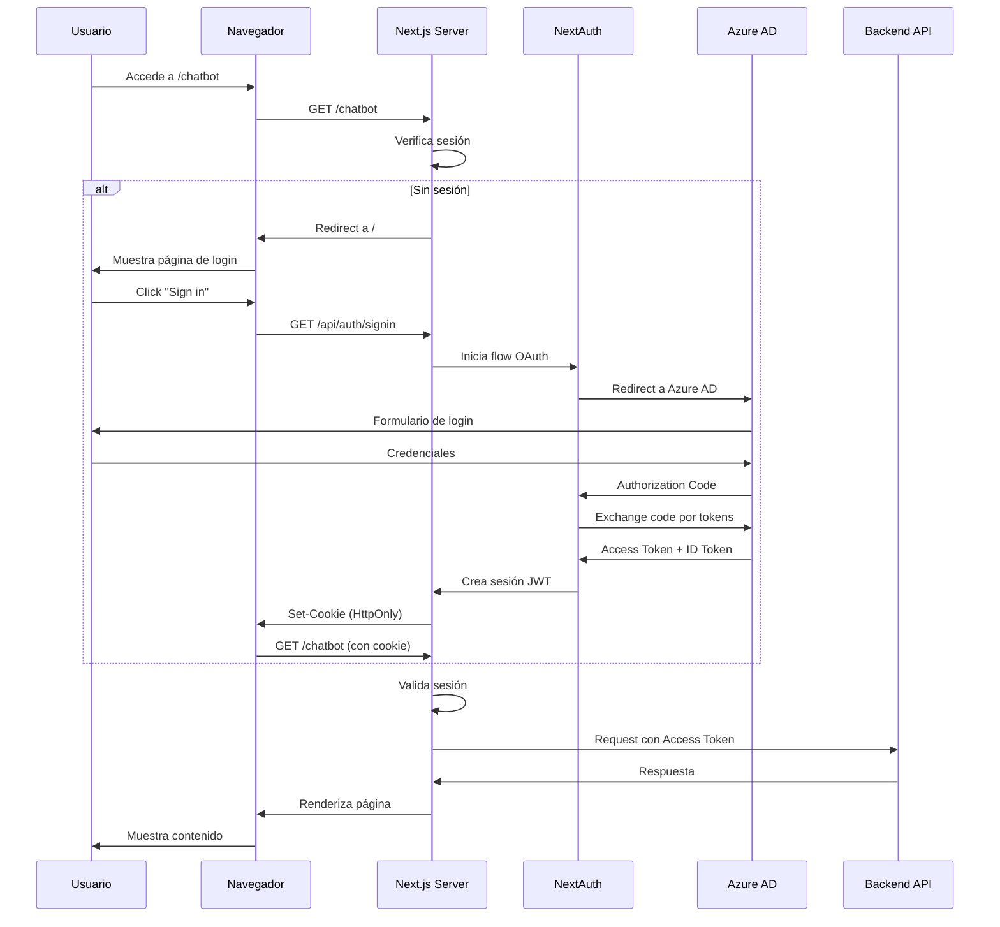

# Autenticación y Autorización en RACMC-GPT

## 📋 Overview

RACMC-GPT utiliza **NextAuth.js** con **Azure AD (Entra ID)** como proveedor de identidad para garantizar autenticación y autorización seguras. Este documento detalla los flujos de autenticación, configuración y mejores prácticas de seguridad implementadas.

---

## 🏗️ Arquitectura de Autenticación

### Stack Tecnológico

| Componente | Tecnología | Propósito |
|------------|------------|-----------|
| **Frontend** | Next.js 15 | Server-side rendering y routing |
| **Auth Library** | NextAuth.js 4.24+ | Gestión de autenticación |
| **Identity Provider** | Azure AD (Entra ID) | Autenticación empresarial |
| **Session Management** | JWT (HttpOnly Cookies) | Almacenamiento seguro de sesiones |
| **Token Storage** | Server-side only | Prevención de exposición al cliente |

### Diagrama de Flujo de Autenticación



---

## 🔐 Configuración de Autenticación

### 1. Variables de Entorno

**Frontend (.env.local):**
```bash
# NextAuth Configuration
NEXTAUTH_URL=http://localhost:3000
NEXTAUTH_SECRET=your-secret-key-min-32-characters

# Azure AD Configuration
AZURE_AD_CLIENT_ID=your-application-client-id
AZURE_AD_CLIENT_SECRET=your-application-client-secret
AZURE_AD_TENANT_ID=your-tenant-id

# Backend API
NEXT_PUBLIC_API_URL=http://localhost:8000
```

**Generar NEXTAUTH_SECRET:**
```bash
openssl rand -base64 32
```

### 2. Configuración de Azure AD (Entra ID)

#### Registro de Aplicación

1. **Azure Portal** → **Entra ID** → **App registrations** → **New registration**

2. **Configuración básica:**
   - **Name**: RACMC-GPT
   - **Supported account types**: Single tenant
   - **Redirect URI**: 
     - Type: Web
     - URL: `https://your-domain.com/api/auth/callback/azure-ad`
     - Development: `http://localhost:3000/api/auth/callback/azure-ad`

3. **Authentication settings:**
   - ✅ Access tokens (used for implicit flows)
   - ✅ ID tokens (used for implicit and hybrid flows)

4. **API permissions:**
   - Microsoft Graph
     - `User.Read` (Delegated)
     - `email` (OpenID)
     - `profile` (OpenID)
     - `openid` (OpenID)

5. **Certificates & secrets:**
   - Create new client secret
   - Copy value immediately (shown only once)
   - Add to `AZURE_AD_CLIENT_SECRET`

#### Token Configuration

**Azure Portal** → **Token configuration** → **Add optional claims**

- **ID Token:**
  - ✅ email
  - ✅ family_name
  - ✅ given_name
  - ✅ upn

- **Access Token:**
  - ✅ email
  - ✅ upn

### 3. Configuración de NextAuth.js

**Archivo: `src/auth.config.ts`**

```typescript
import NextAuth, { NextAuthOptions } from 'next-auth';
import AzureADProvider from 'next-auth/providers/azure-ad';
import { getServerSession } from "next-auth/next";

// Extensión de tipos para incluir accessToken
declare module "next-auth" {
  interface Session {
    accessToken?: string;
  }
}

declare module "next-auth/jwt" {
  interface JWT {
    accessToken?: string;
  }
}

const authOptions: NextAuthOptions = {
  // Páginas personalizadas
  pages: {
    signIn: '/',
    signOut: '/signout',
    error: '/error',
    verifyRequest: '/verify',
  },
  
  // Proveedores de autenticación
  providers: [
    AzureADProvider({
      clientId: process.env.AZURE_AD_CLIENT_ID as string,
      clientSecret: process.env.AZURE_AD_CLIENT_SECRET as string,
      tenantId: process.env.AZURE_AD_TENANT_ID as string,
      authorization: { 
        params: { 
          prompt: "select_account",
          scope: "openid profile email User.Read"
        }
      },
    }),
  ],
  
  // Configuración de sesión
  session: {
    strategy: "jwt",
    maxAge: 24 * 60 * 60, // 24 horas
  },
  
  jwt: {
    maxAge: 24 * 60 * 60, // 24 horas
  },
  
  secret: process.env.NEXTAUTH_SECRET as string,
  
  // Callbacks para personalizar comportamiento
  callbacks: {
    async redirect({ url, baseUrl }) {
      // Después de login exitoso, redirigir a chatbot
      if (url === baseUrl) {
        return `${baseUrl}/chatbot`;
      }
      return url.startsWith("/") ? `${baseUrl}${url}` : baseUrl;
    },
    
    async signIn({ user, account, profile }) {
      // Validación adicional de usuario
      const userInfo = await userService.getUserInfoFromToken(
        account?.access_token as string
      );
      
      if (!userInfo) {
        return false; // Denegar acceso
      }
      
      // Enriquecer información de usuario
      user.email = userInfo.userPrincipalName;
      user.name = userInfo.displayName;
      user.id = userInfo.id;
      
      return true;
    },
    
    async jwt({ token, account }) {
      // Almacenar access token en JWT
      if (account) {
        token.accessToken = account.access_token;
      }
      return token;
    },
    
    async session({ session, token }) {
      // Pasar access token a sesión
      session.accessToken = token.accessToken as string;
      return session;
    },
  },
};

// Helper para obtener sesión en Server Components
export const getSession = async (redirectTo = true) => {
  const session = await getServerSession(authOptions);
  
  if (!session) return null;
  
  // Validar que sesión sigue activa en Azure AD
  const isSessionAlive = await userService.getUserInfoFromToken(
    session.accessToken as string
  );
  
  if (!isSessionAlive && redirectTo) {
    redirect("/signout");
  }
  
  if (!isSessionAlive) return null;
  
  return session;
};

export const handler = NextAuth(authOptions);
```

---

## 🔒 Flujos de Autenticación

### 1. Login (Sign In)

**Usuario no autenticado intenta acceder a ruta protegida:**

```typescript
// app/chatbot/page.tsx (Server Component)
import { getSession } from '@/auth.config';
import { redirect } from 'next/navigation';

export default async function ChatbotPage() {
  const session = await getSession();
  
  if (!session) {
    redirect('/'); // Redirige a login
  }
  
  return <ChatbotInterface user={session.user} />;
}
```

**Página de login:**

```typescript
// app/page.tsx
import { signIn } from 'next-auth/react';

export default function LoginPage() {
  return (
    <button onClick={() => signIn('azure-ad')}>
      Sign in with Microsoft
    </button>
  );
}
```

### 2. Logout (Sign Out)

```typescript
// app/signout/page.tsx
'use client'
import { signOut } from 'next-auth/react';
import { useEffect } from 'react';

export default function SignOutPage() {
  useEffect(() => {
    signOut({ 
      callbackUrl: '/',
      redirect: true 
    });
  }, []);
  
  return <div>Signing out...</div>;
}
```

### 3. Protección de API Routes

```typescript
// app/api/secure-data/route.ts
import { getServerSession } from 'next-auth/next';
import { authOptions } from '@/auth.config';
import { NextResponse } from 'next/server';

export async function GET(request: Request) {
  const session = await getServerSession(authOptions);
  
  if (!session) {
    return NextResponse.json(
      { error: 'Unauthorized' },
      { status: 401 }
    );
  }
  
  // Usuario autenticado - procesar request
  const data = await fetchSecureData(session.accessToken);
  
  return NextResponse.json(data);
}
```

### 4. Middleware para Protección Global

```typescript
// middleware.ts
import { withAuth } from "next-auth/middleware";

export default withAuth({
  pages: {
    signIn: "/",
  },
});

export const config = {
  matcher: [
    "/chatbot/:path*",
    "/api/protected/:path*",
  ],
};
```

---

## 🛡️ Seguridad Implementada

### 1. Token Management

| Aspecto | Implementación |
|---------|----------------|
| **Almacenamiento** | HttpOnly cookies (inaccesibles desde JavaScript) |
| **Transmisión** | HTTPS only (secure flag) |
| **Expiración** | 24 horas (configurable) |
| **Renovación** | Automática con refresh token |
| **Alcance** | SameSite=Lax (CSRF protection) |

### 2. CSRF Protection

NextAuth.js incluye protección CSRF automática mediante:
- CSRF tokens en cookies
- Validación de origin headers
- SameSite cookie attribute

### 3. XSS Protection

```typescript
// Tokens NUNCA expuestos al cliente
// ✅ Correcto (Server Component)
async function SecureComponent() {
  const session = await getSession();
  // session.accessToken disponible solo en servidor
}

// ❌ Incorrecto (Client Component)
'use client'
function InsecureComponent() {
  // No intentes acceder a accessToken aquí
  const { data: session } = useSession();
  // session.accessToken no está disponible
}
```

### 4. Session Validation

```typescript
// Validación continua de sesión
export const getSession = async () => {
  const session = await getServerSession(authOptions);
  
  if (!session) return null;
  
  // Verificar con Azure AD que token sigue válido
  const isValid = await validateTokenWithAzureAD(session.accessToken);
  
  if (!isValid) {
    // Forzar logout si token expiró o fue revocado
    await signOut({ redirect: false });
    return null;
  }
  
  return session;
};
```

---

## 🔑 Uso en Componentes

### Server Components (Recomendado)

```typescript
// app/dashboard/page.tsx
import { getSession } from '@/auth.config';

export default async function DashboardPage() {
  const session = await getSession();
  
  // Acceso completo a información de sesión
  return (
    <div>
      <h1>Welcome, {session.user.name}</h1>
      <p>Email: {session.user.email}</p>
    </div>
  );
}
```

### Client Components

```typescript
// components/UserMenu.tsx
'use client'
import { useSession } from 'next-auth/react';

export function UserMenu() {
  const { data: session, status } = useSession();
  
  if (status === 'loading') return <div>Loading...</div>;
  if (!session) return <div>Not logged in</div>;
  
  return (
    <div>
      <p>{session.user.name}</p>
      {/* session.accessToken NO disponible en cliente */}
    </div>
  );
}
```

---

## 📊 Monitoreo y Logging

### Eventos de Autenticación

```typescript
// auth.config.ts
export const handler = NextAuth({
  ...authOptions,
  debug: process.env.NODE_ENV !== "production",
  logger: {
    error(code, ...message) {
      console.error(`[Auth Error] ${code}:`, message);
      // Enviar a Application Insights
      appInsights.trackException({ 
        exception: new Error(`Auth Error: ${code}`) 
      });
    },
    warn(code, ...message) {
      console.warn(`[Auth Warning] ${code}:`, message);
    },
  },
  events: {
    async signIn({ user, account, profile }) {
      console.log(`User signed in: ${user.email}`);
      // Log a Azure Monitor
    },
    async signOut({ token }) {
      console.log(`User signed out`);
      // Log a Azure Monitor
    },
  },
});
```

---

## 🚀 Despliegue en Azure

### Static Web Apps Configuration

```json
// staticwebapp.config.json
{
  "navigationFallback": {
    "rewrite": "/index.html",
    "exclude": ["/images/*.{png,jpg,gif}", "/css/*"]
  },
  "routes": [
    {
      "route": "/api/*",
      "allowedRoles": ["authenticated"]
    }
  ],
  "responseOverrides": {
    "401": {
      "redirect": "/",
      "statusCode": 302
    }
  }
}
```

### Environment Variables en Azure

```bash
# Azure CLI - Configurar variables
az staticwebapp appsettings set \
  --name racmc-gpt-frontend \
  --setting-names \
    NEXTAUTH_URL=https://racmc-gpt.azurestaticapps.net \
    NEXTAUTH_SECRET=$NEXTAUTH_SECRET \
    AZURE_AD_CLIENT_ID=$CLIENT_ID \
    AZURE_AD_CLIENT_SECRET=$CLIENT_SECRET \
    AZURE_AD_TENANT_ID=$TENANT_ID
```

---

## 🔧 Troubleshooting

### Problemas Comunes

#### 1. "Callback URL Mismatch"

**Error:**
```
Error: Callback URL mismatch
```

**Solución:**
- Verificar que redirect URI en Azure AD coincida exactamente
- Formato correcto: `https://your-domain.com/api/auth/callback/azure-ad`

#### 2. "Session Not Found"

**Error:**
```
Error: Session not found
```

**Solución:**
- Verificar que `NEXTAUTH_SECRET` esté configurado
- Verificar que cookies no estén bloqueadas
- Verificar dominio de cookies en producción

#### 3. "Token Expired"

**Síntoma:** Usuario es deslogueado constantemente

**Solución:**
```typescript
// Aumentar tiempo de sesión
session: {
  maxAge: 24 * 60 * 60, // 24 horas
},
jwt: {
  maxAge: 24 * 60 * 60,
}
```

---

## 🔐 Seguridad Adicional

Para información detallada sobre las medidas de seguridad implementadas para la comunicación API, consulta:

**[Security Implementation Guide](./SECURITY.md)**

Este documento cubre:
- Middleware de seguridad global
- Validación de tokens JWT
- Protección anti-replay con nonces
- Token binding y fingerprinting
- Validación de headers personalizados
- Guía de pruebas de seguridad

---

## 📚 Referencias

- [NextAuth.js Documentation](https://next-auth.js.org/)
- [Azure AD Provider](https://next-auth.js.org/providers/azure-ad)
- [Next.js Authentication](https://nextjs.org/docs/authentication)
- [Next.js Middleware](https://nextjs.org/docs/app/building-your-application/routing/middleware)
- [Microsoft Identity Platform](https://docs.microsoft.com/en-us/azure/active-directory/develop/)
- [OWASP API Security](https://owasp.org/www-project-api-security/)

---

**Última actualización**: Enero 2026  
**Versión**: 1.1.0  
**Responsable**: Syntonize Development Team
