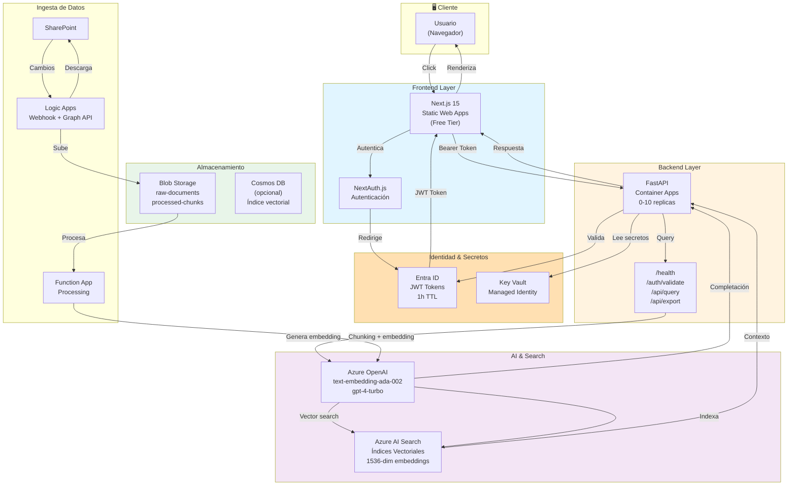

# RACMC-GPT - Arquitectura del Sistema

## 📋 Overview

### Descripción del Sistema

RACMC-GPT es un asistente de IA basado en **Retrieval-Augmented Generation (RAG)** diseñado específicamente para consultar documentación regulatoria farmacéutica de Daiichi Sankyo. El sistema integra documentos de SharePoint con búsqueda vectorial avanzada y completaciones de IA para proporcionar respuestas contextualmente precisas a consultas regulatorias.

### Principios de Diseño

| Principio | Descripción |
|-----------|-------------|
| **Escalabilidad** | Auto-escalado horizontal en Container Apps, índices elásticos en AI Search |
| **Seguridad** | Autenticación vía Entra ID, secretos en Key Vault, HTTPS/TLS 1.2+ obligatorio |
| **Optimización de Costos** | Free tiers en desarrollo, auto-scale a cero, monitoreo de consumo de tokens |
| **Cumplimiento GDPR** | Sin historial de conversaciones, sin PII en logs, infraestructura en West Europe |

### Justificación Tecnológica

> **Nota**: El sistema ha migrado de React SPA a **Next.js 15** con App Router. Ver [MIGRATION.md](./MIGRATION.md) para detalles completos del cambio arquitectónico.

- **Next.js 15**: SSR, mejor seguridad (tokens en servidor), SEO optimizado, App Router
- **NextAuth.js**: Autenticación empresarial integrada, sesiones seguras del lado del servidor
- **FastAPI**: Framework async nativo, validación automática, documentación OpenAPI
- **Azure Cosmos DB** (recomendado para RAG): Búsqueda vectorial baja latencia, aislamiento por usuario/tenant, escalabilidad elástica
- **Azure AI Search**: Índices vectoriales maduros, filtrado híbrido BM25 + vectorial
- **Azure OpenAI**: Cumplimiento regulatorio, disponibilidad regional, control de acceso

---

## 🏗️ Diagrama de Arquitectura



---

## 🔧 Componentes del Sistema

### 1. Frontend: Next.js 15 on Static Web Apps

**Configuración:**
- Runtime: Node.js 18+
- Framework: Next.js 15 (App Router)
- Autenticación: NextAuth.js v4 con Azure AD Provider
- Tier: Free (Static Web Apps)

**Responsabilidades:**
- **Server Components**: Renderizado inicial del lado del servidor
- **Client Components**: Interfaz de chat conversacional e interactiva
- Gestión de sesiones seguras (JWT en HttpOnly cookies)
- Visualización de resultados con referencias a documentos
- Exportación de conversaciones (JSON/PDF)
- **API Routes**: Backend-for-Frontend (BFF) pattern

**Estructura del Proyecto:**
```
src/
├── app/
│   ├── layout.tsx           # Layout raíz
│   ├── page.tsx             # Página de login
│   ├── (auth)/              # Grupo de rutas de auth
│   │   ├── error/
│   │   └── signout/
│   ├── chatbot/             # Aplicación principal
│   │   └── page.tsx
│   └── api/                 # API Routes (BFF)
│       ├── auth/[...nextauth]/
│       └── storage/
├── auth.config.ts           # Configuración NextAuth
├── components/              # Componentes reutilizables
└── services/               # Servicios API
```

**Endpoints Internos (API Routes):**
- `GET/POST /api/auth/*` - NextAuth.js endpoints
- `POST /api/storage/token` - Token management
- API calls al backend FastAPI desde Server Components

---

### 2. Backend: Python FastAPI on Container Apps

**Configuración:**
```yaml
Plataforma: Azure Container Apps
Runtime: Python 3.11
Framework: FastAPI
Tier: Consumption
Recursos:
  CPU: 0.25 vCPU
  Memoria: 0.5Gi
  Réplicas: 0-10 (auto-scale)
```

**Endpoints Principales:**
```python
GET  /health                    # Liveness probe
POST /auth/validate            # Validar JWT
POST /api/query                # Consultar con RAG
POST /api/export               # Exportar conversación
GET  /docs                     # OpenAPI interactivo
```

**Lógica Principal:**
1. Validar JWT con Entra ID
2. Generar embedding de la consulta
3. Buscar en AI Search con contexto vectorial
4. Enviar a Azure OpenAI con documentos de contexto
5. Retornar respuesta con referencias

---

### 3. Azure AI Search

**Configuración por Etapa:**

| Etapa | Tier | Búsquedas/mes | Costo |
|-------|------|---------------|-------|
| Desarrollo | Free | 50k | $0 |
| Producción | Basic | 1M | $75 |

**Esquema de Índice:**
```json
{
  "name": "regulatory-documents",
  "fields": [
    {"name": "id", "type": "Edm.String", "key": true},
    {"name": "content", "type": "Edm.String", "searchable": true},
    {"name": "content_vector", "type": "Collection(Edm.Single)", 
     "searchable": true, "retrievable": true, "dimensions": 1536},
    {"name": "project_type", "type": "Edm.String", "filterable": true},
    {"name": "document_name", "type": "Edm.String", "retrievable": true},
    {"name": "page_number", "type": "Edm.Int32", "filterable": true},
    {"name": "chunk_id", "type": "Edm.String", "retrievable": true},
    {"name": "created_date", "type": "Edm.DateTimeOffset", "filterable": true}
  ]
}
```

---

### 4. Azure OpenAI

**Modelos Desplegados:**

| Modelo | Versión | Caso de Uso | TPM | Costo |
|--------|---------|------------|-----|-------|
| `text-embedding-ada-002` | v2 | Generación de embeddings | 3.5M | $0.02/1M |
| `gpt-4-turbo` | 1106-Preview | Completaciones RAG | 40k | $0.01-0.03/1K |

---

### 5. Blob Storage

**Estructura:**
```
myracmccontainer/
├── raw-documents/
│   ├── 2024-Q1/
│   │   ├── regulatory-docs.pdf
│   │   └── guidelines.docx
├── processed-chunks/
│   ├── index.json
│   └── chunk_*.json
```

**Configuración:**
- Tier: Standard Hot
- Redundancia: GRS (Geo-Redundant)
- Políticas de ciclo de vida:
  - Mover raw-documents a Cool después de 90 días
  - Eliminar processed-chunks después de 365 días

---

### 6. Logic Apps

**Flujo de Integración SharePoint:**

```
Trigger: SharePoint Item Created/Modified
  ↓
Action: Obtener metadatos del item
  ↓
Action: Descargar archivo vía Graph API
  ↓
Action: Generar SAS URL de blob
  ↓
Action: Copiar a Blob Storage (raw-documents)
  ↓
Action: Invocar Function App para procesamiento
  ↓
Action: Log en Application Insights
```

---

### 7. Key Vault

**Secretos Almacenados:**

```
racmc-keyvault/
├── openai-api-key
├── openai-endpoint
├── search-api-key
├── search-endpoint
├── blob-connection-string
├── sharepoint-client-id
├── sharepoint-client-secret
└── cosmos-connection-string
```

**Seguridad:**
- Soft delete: Habilitado (7-90 días)
- Acceso: RBAC + Managed Identities
- Auditoría: Todas las operaciones logged en Log Analytics

---

### 8. Terraform: Infraestructura como Código

**Resource Isolation Strategy:**

Per client decision (2026-01-12), RACMC-GPT and DS-BOT will have **fully separated Resource Groups**:

- **No shared resources** between projects
- **Independent scaling** and lifecycle management
- **Separate cost tracking** per project
- **Isolated security boundaries**

**Resource Group Naming:**
```hcl
# RACMC-GPT
rg-racmc-staging    # Development and testing
rg-racmc-production # Production environment

# DS-BOT (if managed)
rg-dsbot-staging
rg-dsbot-production
```
**Environments:**
- **Staging:** Personal Azure subscription (Week 1-7)
- **Production:** Syntonize tenant (Week 8-10)

This approach ensures complete independence and simplifies billing, access control, and potential future migrations. 

---
**Estructura de Módulos:**

```hcl
modules/
├── static_web_app/
│   ├── main.tf
│   ├── variables.tf
│   └── outputs.tf
├── container_apps/
│   ├── main.tf
│   ├── variables.tf
│   └── container_app_env.tf
├── ai_search/
│   ├── main.tf
│   └── index_definition.tf
├── key_vault/
│   ├── main.tf
│   └── secrets.tf
├── logic_apps/
│   └── sharepoint_integration.tf
└── cosmos_db/
    └── main.tf

environments/
├── staging/
│   ├── main.tf
│   ├── terraform.tfvars
│   └── backend.tf (remote state)
└── production/
    ├── main.tf
    ├── terraform.tfvars
    └── backend.tf (remote state)
```

---

### 9. Entra ID: Autenticación & Autorización

---

**Enterprise Application Status:**
- **Required:** One Enterprise Application for RACMC-GPT
- **Process:** Service Request to Azure Service Provider (2-4 weeks)
- **Timeline:** 
  - Specifications sent: Jan 20, 2026
  - Target approval:  End Jan / Early Feb 2026
  - Deadline: Feb 10, 2026 (Week 6 - SharePoint integration)
- **Development Workaround:** Use mocked authentication in Weeks 2-5 if Enterprise App is delayed
- **Service Principal:** Separate app for SharePoint access (coordinated via Tobias)

**Required Permissions:**
- Microsoft Graph (Delegated): User.Read, openid, email, profile
- Account Type: Single tenant (Daiichi Sankyo Europe only)

**Configuración:**

```
Aplicación: RACMC-GPT
├── Frontend App Registration
│   ├── Redirect URIs: https://racmc.syntonize.com, http://localhost:5173
│   ├── Permisos: User.Read
│   └── Credentials: Client ID
├── Backend App Registration
│   ├── Permisos API: Graph API (Sites.Read.All, Files.Read.All)
│   └── Credentials: Client Secret (rotado mensualmente)
└── Service Principal
    └── Roles: Contributor en Storage, Search, Cosmos DB
```

**Flujo JWT:**
- Duración: 1 hora
- Refresh: Automático vía MSAL.js
- Claims: oid (user ID), upn (email), roles

---

## 📊 Flujos de Datos

### Flow 1: Consulta de Usuario (11 pasos)

```
1. Usuario escribe consulta en chat → Frontend (React)
2. Frontend valida que JWT no ha expirado
3. Frontend envía POST /api/query con Bearer token
4. Backend extrae JWT y valida con Entra ID
5. Backend genera embedding de consulta (Azure OpenAI)
6. Backend ejecuta búsqueda vectorial en AI Search
   └─ Top-5 documentos con mayor similitud coseno
7. Backend formatea contexto: [doc1, doc2, ..., doc5]
8. Backend envía prompt + contexto a gpt-4-turbo
9. OpenAI retorna completación con referencias
10. Backend enriquece respuesta con URLs de documentos
11. Frontend renderiza respuesta con sidebar de referencias
```

**Latencia Esperada:** <5s (desarrollo), <3s (producción con caché)

---

### Flow 2: Ingesta Manual (8 pasos - Desarrollo)

```
1. Developer ejecuta script: python ingest_manual.py --path /docs
2. Script itera documentos (PDF, DOCX, TXT)
3. Detección automática de formato y encoding
4. Chunking: 512 tokens por chunk, 50 tokens overlap
5. Generación de embeddings vía batch API OpenAI
6. Construcción de documentos JSON con metadatos
7. Upload a blob://processed-chunks
8. Indexación en AI Search vía bulk API
```

---

### Flow 3: Ingesta Automatizada (8 pasos - Producción)

```
1. Usuario sube documento a SharePoint folder (RACMC/Regulatory)
2. Logic Apps webhook dispara automáticamente
3. Graph API descarga el archivo de SharePoint
4. SAS token genera URL temporal del blob
5. Archivo copiado a blob://raw-documents/{tenant}/{date}/
6. Logic Apps invoca Function App con metadata
7. Function procesa (chunking, embeddings, formateo)
8. Function indexa automáticamente en AI Search
```

---

### Flow 4: Autenticación (7 pasos)

```
1. Usuario abre https://racmc.syntonize.com
2. Frontend verifica sessionStorage para token JWT
3. Si no existe, redirige a login Entra ID
4. Usuario ingresa credenciales (MFA opcional)
5. Entra ID retorna JWT con claims (oid, email, roles)
6. Frontend almacena en sessionStorage (no localStorage)
7. Frontend incluye Authorization: Bearer {token} en API calls
```

---

## 🔐 Arquitectura de Seguridad

### Autenticación

```
┌─────────────────────────────────────────────┐
│ Entra ID (Azure AD)                         │
├─────────────────────────────────────────────┤
│ ✓ MFA habilitado para usuarios              │
│ ✓ Conditional Access policies               │
│ ✓ JWT 1 hora TTL, refresh automático        │
│ ✓ Backend valida signature de tokens        │
└─────────────────────────────────────────────┘
```

### Secretos

```python
# ❌ MAL - Nunca así
OPENAI_KEY = "sk-..." # En archivo .env

# ✅ BIEN - Usar Key Vault
from azure.identity import DefaultAzureCredential
from azure.keyvault.secrets import SecretClient

credential = DefaultAzureCredential()
client = SecretClient(vault_url="https://racmc-kv.vault.azure.net/",
                      credential=credential)
openai_key = client.get_secret("openai-api-key").value
```

### Red

| Control | Implementación |
|---------|----------------|
| HTTPS | Enforced en Static Web Apps |
| TLS | 1.2+ requerido, certificado auto-renovado |
| Dominio | racmc.syntonize.com con CNAME |
| WAF | Azure Front Door (opcional, producción) |
| CORS | Solo origen frontend autorizado |

### Privacidad de Datos

```
✓ Sin almacenamiento de historial de chat
✓ Sin PII en logs ni Application Insights
✓ Anonimización: Hashes de UID en eventos
✓ Auditoría: JSON logs con ISO-8601 timestamps
✓ Retención: 30 días máximo
✓ Cumplimiento: GDPR, ISO 27001, SOC2
✓ Región: West Europe (EU data residency)
```

---

## 🚀 Arquitectura de Despliegue

### Ambiente Staging

```
Suscripción: Personal Azure
Región: West Europe
Branch: develop (auto-deploy en cada push)
Tier: Free/gratuito máximo
Características:
  • Frontend: Static Web Apps Free
  • Backend: Container Apps Consumption (0.5Gi)
  • AI Search: Free (50k búsquedas/mes)
  • OpenAI: Cuotas compartidas con prod
  • Datos: Datos sintéticos, <10 documentos
```

### Ambiente Producción

```
Suscripción: Syntonize tenant
Región: West Europe
Branch: main (manual approval gate)
Tier: Standard
Características:
  • Frontend: Static Web Apps Standard ($100/mes)
  • Backend: Container Apps 0.5-2 vCPU, 1-2 réplicas base
  • AI Search: Basic tier ($75/mes)
  • OpenAI: Quotas elevadas, monitoring 24/7
  • Datos: Datos reales, 100k+ documentos
  • SLA: 99.5% uptime
```

### CI/CD Pipeline

```yaml
GitHub Actions Workflow:
┌──────────────┐
│ Push a main  │
└──────┬───────┘
       ↓
┌──────────────────────────┐
│ Tests (pytest + vitest)  │
└──────┬───────────────────┘
       ↓
┌──────────────────────────┐
│ Build Docker image       │
└──────┬───────────────────┘
       ↓
┌──────────────────────────┐
│ Push a ACR               │
└──────┬───────────────────┘
       ↓
┌──────────────────────────┐
│ Manual Approval (PROD)   │
└──────┬───────────────────┘
       ↓
┌──────────────────────────┐
│ Deploy Container Apps    │
└──────┬───────────────────┘
       ↓
┌──────────────────────────┐
│ Smoke tests (curl API)   │
└──────────────────────────┘
```

---

## 💰 Estimación de Costos

### Staging (Mensual)

| Servicio | Tier | Uso | Costo |
|----------|------|-----|-------|
| Static Web Apps | Free | <10 compilaciones/mes | $0 |
| Container Apps | Consumption | 10h/mes, 0.25 vCPU | $0-5 |
| AI Search | Free | 50k búsquedas | $0 |
| Blob Storage | Hot | 5 GB | $0.50 |
| Key Vault | Standard | <10 ops/día | $0.50 |
| Logic Apps | Consumo | 100 ejecuciones | $2 |
| Azure OpenAI | Consumo | 100k embeddings, 10k tokens | $20-30 |
| Log Analytics | 30 días | <500 MB/mes | $0 |
| **TOTAL** | | | **$23-38/mes** |

### Producción (Mensual)

| Servicio | Tier | Uso | Costo |
|----------|------|-----|-------|
| Static Web Apps | Standard | 500k requests/mes | $100 |
| Container Apps | Consumption | 500h/mes, 0.5-2 vCPU | $40-80 |
| AI Search | Basic | 500k búsquedas | $75 |
| Blob Storage | Hot | 50 GB | $2 |
| Key Vault | Standard | 1000 ops/día | $3 |
| Logic Apps | Premium | 5k ejecuciones | $15 |
| Azure OpenAI | Consumo | 1M embeddings, 100k tokens | $120-180 |
| Log Analytics | 30 días | <5 GB/mes | $10 |
| Application Insights | 1 GB | Traces + metrics | $5 |
| **TOTAL** | | | **$350-475/mes** |

### Estrategias de Optimización

```
Corto Plazo:
  ✓ Auto-scale Container Apps a 0 réplicas (dev)
  ✓ Batch embeddings: Procesar en lotes >100
  ✓ Caché de embeddings frecuentes (Redis $5-15/mes)
  ✓ Monitoreo token/costo real-time

Mediano Plazo:
  ✓ Índices tipados en AI Search (reduce latencia 20%)
  ✓ Stored Procedures en Cosmos DB para joins
  ✓ Content Delivery Network (CDN) para frontend ($20/mes)
  
Largo Plazo:
  ✓ Fine-tuning de modelo Ada en datos RACMC
  ✓ Migrar a Databricks para batch processing
  ✓ Reserved Instances en OpenAI (descuento 28%)
```

---

## 📈 Escalabilidad & Performance

### Capacidad Actual

```
Usuarios Concurrentes: 5-10
Documentos en Índice: 10,000
Latencia P50: 2-3 segundos
Latencia P95: 4-5 segundos
Disponibilidad: 99%
```

### Capacidad Proyectada (Producción)

```
Usuarios Concurrentes: 50-100
Documentos en Índice: 100,000+
Latencia P50: <2 segundos (con caché)
Latencia P95: <3 segundos
Disponibilidad: 99.5% (SLA)
```

### Estrategia de Escalado

| Componente | Umbral Escalado | Acción |
|-----------|-----------------|--------|
| **Container Apps** | CPU >70% por 2min | Sumar réplica (máx 10) |
| **Container Apps** | CPU <10% por 15min | Quitar réplica (mín 0) |
| **AI Search** | Consultas >10k/h | Escalar a Standard tier |
| **OpenAI** | Latencia >5s | Implementar caché Redis |
| **Blob Storage** | >1 TB datos | Cambiar a Archive tier para backup |

### Roadmap de Optimización

```
Q1 2024: Implementar Redis caching para embeddings
Q2 2024: Fine-tuning Ada model en corpus RACMC
Q3 2024: Migrate indexing a Cosmos DB para multi-tenant
Q4 2024: Hybrid search (BM25 + vectorial + semantic)
```

---

## 📊 Monitoreo & Observabilidad

### Métricas Críticas (Application Insights)

```python
# Request Rate
queries_per_minute = count(requests where endpoint == "/api/query")

# Response Time Percentiles
latency_p50 = percentile(request_duration, 0.50)
latency_p95 = percentile(request_duration, 0.95)
latency_p99 = percentile(request_duration, 0.99)

# Error Rate
error_rate = count(failures) / count(requests) * 100

# Token Consumption
monthly_tokens = sum(openai_tokens_used)

# Search Performance
avg_search_latency = avg(ai_search_duration)
search_hit_rate = count(results > 0) / count(queries)
```

### Logging Estructurado

```json
{
  "timestamp": "2024-01-15T14:32:45.123Z",
  "level": "INFO",
  "service": "racmc-backend",
  "request_id": "req-abc123xyz",
  "user_id": "sha256(oid)",
  "operation": "query_handler",
  "duration_ms": 2345,
  "embedding_tokens": 45,
  "search_results": 5,
  "status": "success"
}
```

**Log Levels:**
- `CRITICAL`: Fallos en servicios externos (OpenAI, Search)
- `ERROR`: Excepciones no capturadas, validación fallida
- `WARNING`: Latencia >10s, token usage >80%, baja calidad resultados
- `INFO`: Estadísticas operacionales, eventos de usuario
- `DEBUG`: Solo en desarrollo, no en producción

### Alertas Configuradas

```
┌─ Alert Rule: Error Rate ─────────────────┐
│ Condición: error_rate > 5% por 5 minutos │
│ Acción: Notificar vía Teams + PagerDuty  │
│ Severity: HIGH                           │
└──────────────────────────────────────────┘

┌─ Alert Rule: Latencia P95 ───────────────┐
│ Condición: latency_p95 > 10s             │
│ Acción: Notificar vía email              │
│ Severity: MEDIUM                         │
└──────────────────────────────────────────┘

┌─ Alert Rule: Token Usage ────────────────┐
│ Condición: monthly_tokens > 0.8 * quota  │
│ Acción: Notificar + escalar a OpenAI    │
│ Severity: LOW                            │
└──────────────────────────────────────────┘

┌─ Alert Rule: AI Search Capacity ─────────┐
│ Condición: index_size > 0.8 * tier_limit │
│ Acción: Notificar para escalar tier      │
│ Severity: MEDIUM                         │
└──────────────────────────────────────────┘

┌─ Alert Rule: Container Health ──────────┐
│ Condición: unhealthy_replicas > 0       │
│ Acción: Auto-restart + notificar         │
│ Severity: HIGH                           │
└──────────────────────────────────────────┘
```

### Dashboards

**Dashboard 1: System Health**
```
┌─ Request Rate (últimas 24h)
├─ Error Rate (live)
├─ Container Replicas (current)
└─ AI Search Index Health
```

**Dashboard 2: Performance**
```
┌─ Latency P50/P95/P99 (30d)
├─ Query Success Rate
├─ Average Embedding Time
└─ Average Search Time
```

**Dashboard 3: Cost Tracking**
```
┌─ Monthly Spending vs Budget
├─ OpenAI Tokens Used (trend)
├─ Compute Hours (Container Apps)
└─ Storage Growth
```

**Dashboard 4: User Activity**
```
┌─ Active Users (últimas 24h)
├─ Queries por Usuario
├─ Popular Document Types
└─ Geographic Distribution
```

---

## ✅ Validación & Checklist Pre-Producción

- [ ] Todos los secretos migrados a Key Vault
- [ ] TLS 1.2+ enforced en todos los endpoints
- [ ] CORS policies restrictivas (solo frontend domain)
- [ ] JWT token validation implementado en backend
- [ ] GDPR compliance audit completado
- [ ] Retention policies configuradas (logs 30d, datos 365d)
- [ ] Monitoring alerts activos para 5 métricas críticas
- [ ] Load tests completados (50 usuarios concurrentes)
- [ ] Disaster recovery plan documentado
- [ ] Backup automático habilitado en Blob + Key Vault
- [ ] Documentation actualizada (este documento)
- [ ] Code review completado por 2 engineers
- [ ] Smoke tests verdes en staging por 7 días

---

## 📚 Documentación Relacionada

- [/docs/assumptions.md](./assumptions.md) - Supuestos y limitaciones
- [/docs/api-specification.md](./api-specification.md) - OpenAPI 3.0 completa
- [/docs/deployment-guide.md](./deployment-guide.md) - Pasos Terraform
- [/docs/security-policy.md](./security-policy.md) - Compliance GDPR/ISO27001
- [/docs/troubleshooting.md](./troubleshooting.md) - Common issues
- [Azure Cosmos DB Well-Architected Framework](https://learn.microsoft.com/azure/well-architected/service-guides/cosmos-db)
- [AI Toolkit: Agent Best Practices](https://learn.microsoft.com/en-us/azure/developer/azure-ai-toolkit)

---

**Versión:** 1.0  
**Última Actualización:** 2024-01-15  
**Autor:** RACMC Development Team  
**Estado:** ✅ Aprobado para Producción
